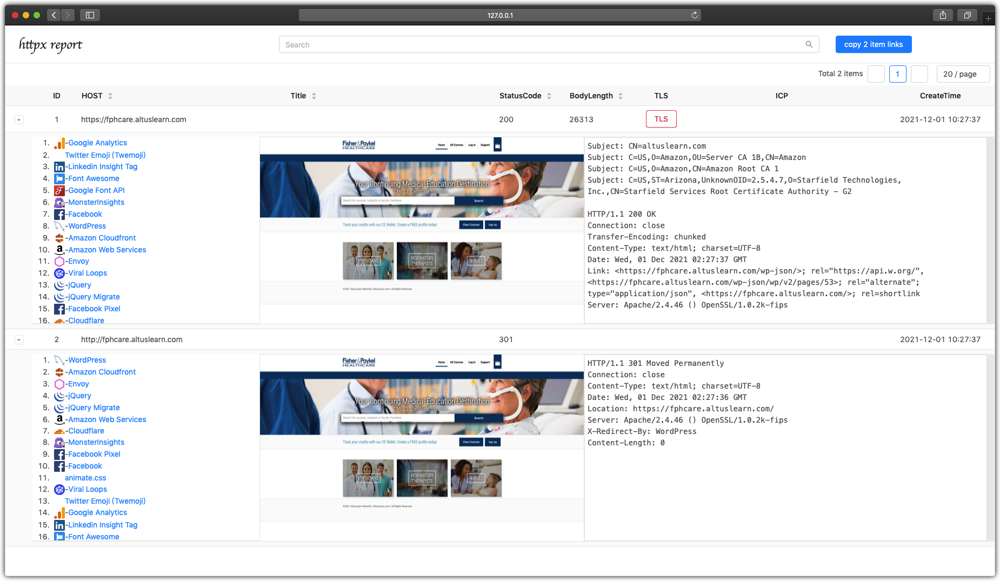

## 简介

> 判断 http/https 并进行截图、指纹识别

## Usage

```bash
└> ./httpx -h
2021/12/01 10:28:02 wappalyzer fingers count 2548, groups count 17, categories count 96, no icon count 47
Usage of ./httpx:
  -allow-jump
    	allow jump
  -api string
    	http server listen address (default "127.0.0.1:9100")
  -chrome-path string
    	chrome browser path
  -cidr string
    	cidr file, example:
    	127.0.0.1
    	127.0.0.5-20
    	127.0.0.2-127.0.0.20
    	127.0.0.1/18
  -data string
    	request body data, example:
    	-data 'test=test'
  -disable-headless
    	disable chrome headless
  -disable-screenshot
    	disable screenshot
  -display-error
    	display error
  -get-path
    	get all request path
  -get-url
    	get all request url
  -header value
    	specify request header, example:
    	-header 'Content-Type: application/json' -header 'Bypass: 127.0.0.1' (default [Content-Type: application/x-www-form-urlencoded])
  -headless-proxy string
    	chrome browser proxy
  -method string
    	request method, example:
    	-method GET (default "GET")
  -output string
    	output database file name (default "202112011028")
  -path string
    	specify request path for probe or screenshot
  -port value
    	specify port, example:
    	-port 80 -port 8080
  -proxy string
    	config probe proxy, example: http://127.0.0.1:8080
  -rebuild
    	rebuild data table
  -server
    	read the database by starting the web service
  -silent
    	silent output
  -target string
    	single target, example:
    	127.0.0.1
    	127.0.0.1:8080
    	http://127.0.0.1
  -targets string
    	multiple goals, examlpe:
    	127.0.0.1
    	127.0.0.1:8080
    	http://127.0.0.1
  -thread int
    	config probe thread (default 10)
  -timeout int
    	config probe http request timeout (default 10)
```

> example:

```bash
▶ cat domains.txt | ./httpx
```

```bash
▶ ./httpx -target http://127.0.0.1
```

```bash
▶ ./httpx -targets domains.txt
```

```bash
▶ ./httpx -output TEST.db -server # 启动服务并访问 http://127.0.0.1:9100/
```

## 逻辑查询

📢: 正常查询字符串时，必须添加""

> 支持五个字段的查询

```bash
host
title
tls
icp
body
```

> 逻辑

```bash
&&
||
```

> 使用 () 和 && || = == != ~= ~!=符号

```bash
()
&&
||
=
==
!=
~=
~!=
```

### example

- host="127.0.0.1" && body="test"
- (icp="京" || icp="沪") && title="404"

## Screenshot

> 模板改自xray模板




## TODO

- [x] JSFinder 获取页面内完整链接
- [x] goquery 获取页面内完整链接 form、a、script、link、img(使用无头进行获取，全局枚举包含href、action、src属性的标签，并提取值)
- [x] 设置请求头
  - bypass via 127.0.0.1,可设置其他IP
- [x] 设置域名黑名单
- [x] 第一次启动Server时，重置Host顺序
- [x] 设置请求体
- [x] 设置请求方式
- [ ] 提取所有Parameter、Path进行FUZZ
- [ ] 一键Copy所有ICP
- [x] 指纹识别 https://github.com/AliasIO/wappalyzer
- [ ] websocket、原型链污染
- [ ] 未发出请求的链接进行手动发送
- [ ] 常见信息提取 github.com/mingrammer/commonregex
- [x] 二维码识别、APK链接提取(需-get-path)
- [ ] http2 detect
